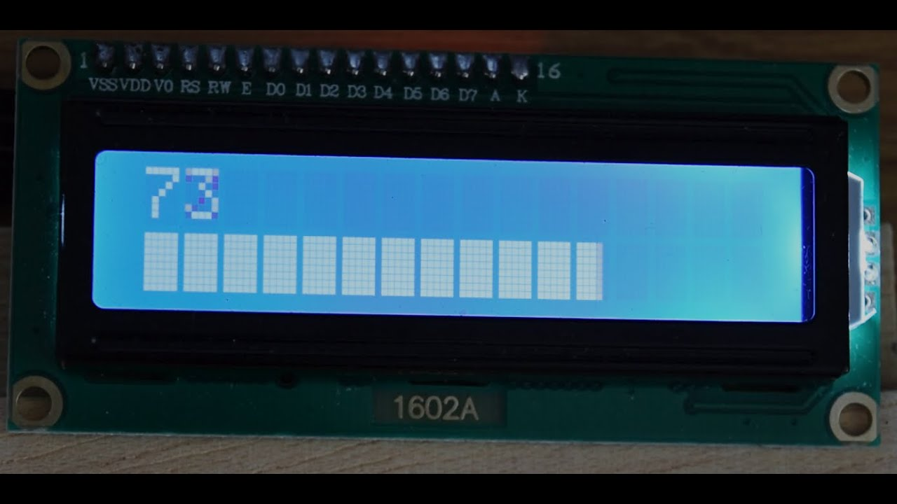
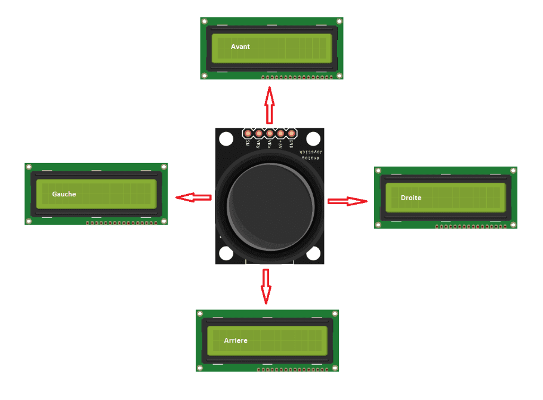
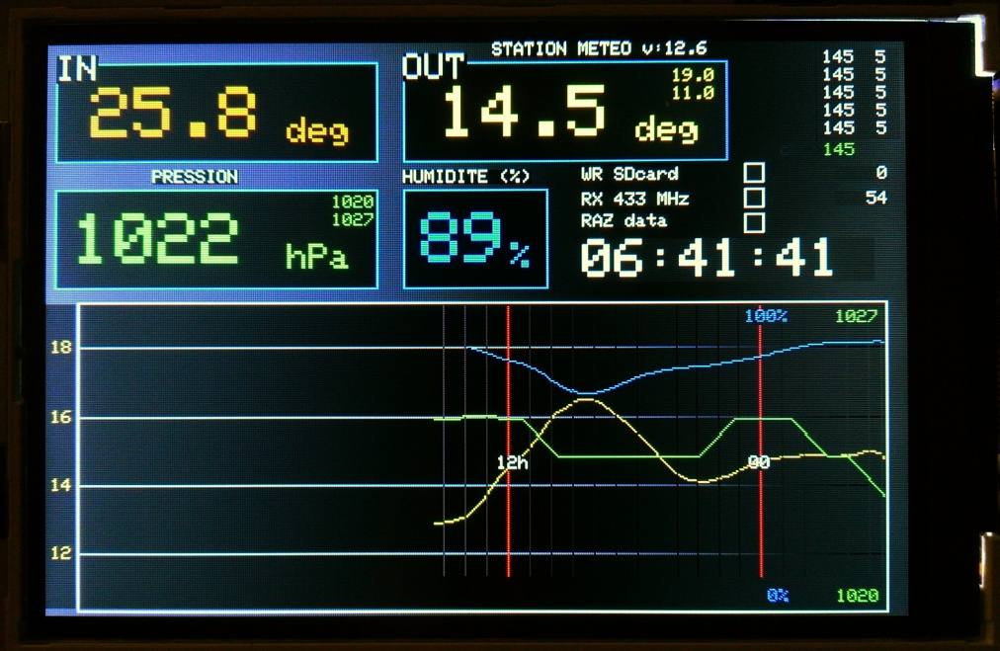

# Arduino (FR/EN)
--------------------

*Arduino, c'est comme une relation électrique parfaite : une connexion
bien établie sans jamais trop de résistance !*

*Arduino is like a perfect electrical relationship: a well-established
connection without too much resistance!*

## Introduction à l’Arduino / Introduction to Arduino
----------------
**FR:**

Afin de pouvoir rendre vos jobs du jour, inscrivez-vous sur
[Tinkercad](https://www.tinkercad.com/) .

Tinkercad est un outil de modélisation 3D en ligne qui permet aux
utilisateurs de créer des schémas. Il offre la possibilité de simuler
des circuits, de réaliser des tests et d’éviter d’endommager le
matériel.

Pour chaque job, **créer** et **exporter** un schéma en format PNG
portant le numéro du job ou le nom du job ainsi que le code associé,
puis faites le montage à l’aide du kit fourni.

**EN:**

In order to turn in your jobs for the day, sign up for Tinkercad .

Tinkercad is an online 3D modeling tool that enables users to create
schematics. It allows you to simulate circuits, perform tests and avoid
damaging hardware.

For each job, create and export a schematic in PNG format bearing the
job number or job name and associated code, then make the assembly using
the kit supplied.

## Job 1
-------------------------------------
**FR:**

Pour fonctionner, l’Arduino a besoin d’une source d’alimentation. Grâce
au matériel mis à votre disposition, le mettre sous tension.

**EN:**

To operate, the Arduino needs a power source. Using the equipment
provided, power it up

## Job 2
-----------------------------------------------------------
**FR:**

Comme vous le comprenez, pour faire fonctionner le composant de
l’Arduino,

il faut du courant électrique. Les résistances ont un rôle important
dans le circuit.

Lors du branchement de module à votre carte Arduino, comme une LED par
exemple, il est crucial de surveiller le courant pour éviter tout risque
de dommage. Les **résistances** permettent de limiter le courant
assurant ainsi la protection des composants.

En fonction des informations suivantes, calculer les valeurs nécessaires
à la résistance pour obtenir un courant de 10 milliampères à travers la
LED.

-   La tension de seuil de la LED est de 2 volts
-   La tension d’alimentation de l’Arduino est de 5 volts
-   Le courant maximal que peut supporter la LED est de 20 milliampères

<!-- -->

-   Le port de sortie de l’Arduino peut fournir une tension de 5 volts
    et un courant max de 40 milliampères

Créer un fichier nommé “**job2.pdf**” dans lequel se trouve votre
résultat.

**EN:**

As you can see, to operate the Arduino component, requires electrical
current. Resistors play an important role in the circuit.

When connecting a module to your Arduino board, like an LED for example,
it's crucial to monitor the current to avoid any risk of damage.
**Resistors** are used to limit the current, thus protecting the
components.

Based on the following information, calculate the resistor values
required to obtain a current of 10 milliamps through the LED.

-   The LED's threshold voltage is 2 volts
-   The Arduino's supply voltage is 5 volts
-   The maximum current the LED can withstand is 20 milliamps
-   The Arduino's output port can supply a voltage of 5 volts and a
    max current of 40 milliamps

Create a file named “**job2.pdf**” containing your results.

## Job 3
--------------------------------------------
**FR:**

À l’aide du matériel fourni et sans code, connectez une LED à votre
Arduino. Cette LED doit être éclairée sans jamais s’éteindre.
Assurez-vous de choisir une résistance appropriée pour votre LED.

**EN:**

Using the supplied hardware and no code, connect an LED to your Arduino.
This LED must light up and never go out. Make sure you choose an
appropriate resistor for your LED.

## Job 4
-----------------------------------------------------
**FR:**

Sans code, réaliser un montage électrique pour éclairer une LED en
série.

Ensuite, réaliser un deuxième montage pour éclairer une LED en
parallèle.

**EN:**

Without code, create an electrical circuit to illuminate an LED in
series.

Then, create a second circuit to illuminate an LED in parallel.

## Job 5
----------------------------------------------
**FR:** 

Passons au code !

Bien que vous puissiez écrire du code dans n’importe quel éditeur de
texte, un IDE est fortement conseillé. Il permet de simplifier
l’écriture du code, le téléversement du code et la gestion des
bibliothèques.

Installer l’IDE Arduino.

**EN:**

Let's get to the code!

Although you can write code in any text editor, an IDE is highly
recommended. It simplifies code writing, code uploading and library
management.

Install the Arduino IDE.

## Job 6
------------------------------
**FR:** 

Écrire deux programmes. Un qui permet de faire clignoter deux LED de
façon **synchrone** et un qui permet de faire clignoter deux LED de
façon **asynchrone**.

**EN:**

Write two programs. One to flash two LEDs **synchronously** and one to
flash two LEDs **asynchronously**.

## Job 7
--------------------------
**FR:** 

Écrire un programme qui permet de faire clignoter huit LED à tour de
rôle.

**EN:**

Write a program to flash eight LEDs in turn.

## Job 8
----------------------------------
**FR:** 

Écrire un programme qui allume une LED progressivement.

**EN:**

Write a program that gradually lights up an LED.

## Job 9
---------------------------
**FR:**

À l’aide de LED et du bouton, écrire un programme qui exécute les
actions suivantes :

- À l'appui du bouton, la LED s’allume

- En appuyant deux fois sur le bouton, la LED reste allumée

- En appuyant trois fois sur le bouton, la LED clignote

- En cas d'appui prolongé sur le bouton, la LED s'éteint

**EN:**

Using LEDs and the button, write a program that performs the following
actions:

- When the button is pressed, the LED lights up

- When the button is pressed twice, the LED stays lit

- When the button is pressed three times, the LED flashes

- When the button is pressed for a long time, the LED goes out.

## Job 10
-------------------
**FR:**

À l’aide de deux LED et d’un potentiomètre, faites en sorte qu'à la
rotation de celui-ci l’intensité lumineuse d’une des deux LED augmente
tandis que celle de l’autre diminue.

**EN:**

Using two LEDs and a potentiometer, rotate the potentiometer so that the
light intensity of one LED increases while that of the other decreases.

## Job 11
------------------------------------------------
**FR:**

Écrire un programme qui exécute les actions suivantes :

-   Si un bouton est pressé, une LED s’allume.
-   La LED doit s’éteindre au bout de 15 secondes puis le ventilateur se
    met en marche
-   Si le bouton est à nouveau pressé, le ventilateur s’éteint.

**EN:**

Write a program that performs the following actions:

-   If a button is pressed, an LED lights up.
-   The LED should go out after 15 seconds, then the fan starts
-   If the button is pressed again, the fan goes out.

## Job 12
------------------------
**FR:**

Afficher sur l’**afficheur LCD** la valeur suivante : “**Hello World
!**”

**EN:**

Display the following value on the **LCD**: “**Hello World!**”

## Job 13
------------
**FR:**

Dessiner un smiley et l’afficher sur l’afficheur LCD.

**EN:**

Draw a smiley face and display it on the LCD.

## Job 14
----------
**FR:**

Écrire un programme qui permet d’écrire sur la première ligne de
l’afficheur LCD le nom de votre groupe et sur la deuxième ligne un
compteur représentant le temps d’affichage.

Un bouton pressoir doit être ajouté afin d’arrêter ou relancer le
compteur.

**EN:**

Write a program to write the name of your group on the first line of the
LCD display, and a counter representing the display time on the second
line.

A press button must be added to stop or restart the counter.

## Job 15
-----------
**FR:**

Changer la couleur d’une LED RGB avec un **potentiomètre**.

**EN:**

Change the color of an RGB LED using a **potentiometer**.

## Job 16
-------------
**FR:**

Écrire un programme qui affiche l’heure sur l’afficheur LCD au format
HH:MM:SS.

**EN:**

Write a program to display the time on the LCD in HH:MM:SS format.

## Job 17
-------
**FR:**

Créer votre **chronomètre**. Pour lancer le chronomètre, l’utilisateur
doit presser un bouton. Le temps écoulé est affiché sur l’afficheur LCD.

**EN:**

Create your **stopwatch**. To start the stopwatch, the user must press a
button. The elapsed time is displayed on the LCD.

## Job 18
-------------
**FR:**

Écrire un programme qui réalise une barre de chargement sur votre
afficheur LCD. Un rectangle doit être affiché toutes les trois secondes.

**EN:**

Write a program to create a loading bar on your LCD display. A rectangle
must be displayed every three
seconds.

## Job 19
-----------------
**FR:**

Afficher sur l’écran LCD le sens de direction du joystick. Lorsque que
l’utilisateur dirige le joystick à droite, le mot “Droite” est affiché,
quand il est dirigé vers la gauche, le mot “Gauche” est affiché…

**EN:**

Display the direction of the joystick on the LCD screen. When the user
directs the joystick to the right, the word “Right” is displayed, when
it is directed to the left, the word “Left” is displayed…

## Job 20
----------------
**FR:**

Créer un programme qui permet de mesurer une distance et d’afficher la
mesure via l’écran LCD.

**EN:**

Create a program to measure a distance and display the measurement on
the LCD screen.

## Station météo / Weather Station
------------------------------------------------
**FR:**

Une station météo est un ensemble de capteurs qui permet la mesure et
l’enregistrement de la mesure physique et météorologique liée au
changement du climat. Elle permet de prévoir à court ou moyen terme, de
prévoir le temps qu’il va faire, mais aussi de prendre des décisions
dans notre quotidien. La météo fait partie d’un aléa avec lequel il faut
composer.

Le but de cet exercice est de créer une mini-centrale météo à l’aide du
kit Arduino fourni qui affichera les différentes mesures sur une bande
LED RGB et sur l’écran Oled ou sur l’écran LCD deux lignes.

Afficher les éléments suivant sur l’écran :

-   La température de la pièce
-   Le taux d’humidité de la pièce
-   La pression atmosphérique

Les valeurs doivent défiler et rester affichées deux secondes.

**EN:**

A weather station is a set of sensors that measures and records physical
and meteorological data related to climate change. It enables us to
forecast the weather in the short or medium term, and to make decisions
in our daily lives. Weather is part of a hazard with which we have to
contend.

The aim of this exercise is to create a mini weather station using the
Arduino kit supplied, which will display the various measurements on an
RGB LED strip and on the Oled or two-line LCD screen.

Display the following on the screen:

-   Room temperature
-   Room humidity
-   Atmospheric pressure

The values should scroll and remain displayed for two seconds.

## Tableau de bord / Dashboard
--------------------------------------------
**FR:**

Créer votre tableau de bord. Celui-ci doit avoir au minimum les
fonctionnalités suivantes:

-   Récupérer la température. Si la température est comprise entre 10 et
    18 degrés Celsius, une LED bleue s’allume, si la température est
    comprise entre 19 et 21, la LED rouge s’allume et enfin si la
    température est supérieure à 22, le ventilateur démarre.
-   Récupérer le taux d’humidité. Allumer une LED verte si l’humidité de
    la pièce est confortable, sinon allumer une LED jaune.
-   Récupérer la luminosité.
-   Ajouter un bouton qui affiche et fait défiler les informations
    recueillies sur l’afficheur LCD.
-   Ajouter un capteur de distance qui calcule la distance avec un
    obstacle et votre capteur ultra son, attention à la température !
    Pensez à avertir l’utilisateur grâce au buzzer que l’objet se
    rapproche.

Pour avoir accès à toutes ses fonctionnalités, pensez à démarrer !

Pour ce faire, ajouter un bouton ou autre qui lancera le moteur et
permettra d’avoir accès au fonctionnement du LCD.

**EN:**

Create your own dashboard. It must have at least the following
functionalities:

-   Temperature retrieval. If the temperature is between 10 and 18
    degrees Celsius, a blue LED lights up, if the temperature is between
    19 and 21, the red LED lights up, and if the temperature is over 22,
    the fan starts.
-   Collect humidity level. Light a green LED if room humidity is
    comfortable, otherwise light a yellow LED.
-   Retrieve brightness.
-   Add a button that displays and scrolls the information collected on
    the LCD display.
-   Add a distance sensor that calculates the distance to an obstacle
    and your ultrasonic sensor, paying attention to the temperature!
    Don't forget to use the buzzer to warn the user that the object is
    getting closer.

To access all its functions, remember to get started!

To do this, add a button or other device that will start the motor and
provide access to LCD operation.

## Jeu de mémoire / Memory game
----------------------------------------------
**FR:**

À l’aide de vos connaissances fraîchement acquises ainsi que votre kit
Arduino, créez votre jeu de mémoire.

L’utilisateur doit regarder une séquence de lumières clignotantes (de
différentes couleurs). Une fois la séquence terminée, le joueur doit
reproduire celle-ci en appuyant sur les boutons dans l’ordre dans lequel
elles se sont allumées.

Si les boutons sont pressés dans le bon ordre, le jeu continue avec une
séquence plus longue.

Sinon, un signal sonore annonce l’erreur au joueur. Le jeu recommence du
début et un message s’affiche sur l’écran LCD.

À chaque bonne réponse, le joueur gagne 1 point.

Sur l’écran doit apparaître le niveau du joueur ainsi que son compteur
de points.

Implémenter des niveaux de difficultés différents.

**EN:**

Using your newly acquired knowledge and your Arduino kit, create your
own memory game.

The user must watch a sequence of flashing lights (of different colors).
Once the sequence is complete, the player must reproduce it by pressing
the buttons in the order in which they lit up.

If the buttons are pressed in the right order, the game continues with a
longer sequence.

If not, an acoustic signal announces the error to the player. The game
starts again from the beginning and a message appears on the LCD screen.

For each correct answer, the player earns 1 point.

The display should show the player's level and point counter.

Implement different levels of difficulty.

## Compétences visées / Target Skills
-----------------------------------------------------
-   Utiliser un Arduino / Using an Arduino
-   Algorithme / Algorithms
-   Programmation “embarqué”, domotique / Embedded programming, home automation

## Rendu
-------------------------------------------------------
**FR:**

Le projet est à rendre sur **https://github.com/prenom-nom/Arduino**.

Pour chaque jour, créer un dossier nommé “**jourXX**” ou **XX** est le
numéro du job et pour chaque job, dans celui-ci doit s’y trouver le
schéma ainsi que le fichier contenant le code créer.

Pensez à mettre le repository en public !

L'évaluation se déroulera à travers la présentation du projet, sans
qu'un support visuel ne soit nécessaire.

**EN:**

The project is available at **https://github.com/prenom-nom/Arduino**.

For each day, create a folder called “**dayXX**”, where **XX** is the
job number. For each job, this folder must contain the schematics and
the file containing the code to be created.

Don't forget to make the repository public!

The evaluation will take place through the presentation of the project,
without the need for any visual support.

## Base de connaissances / Knowledge Base
---------------------------------

-   [Site officiel Arduino](https://www.arduino.cc/)
-   [Les résistances](https://pecquery.wixsite.com/arduino-passion/la-resistance)
-   [Allumer une LED](https://www.robotique.tech/tutoriel/allumer-une-led-par-arduino/)
